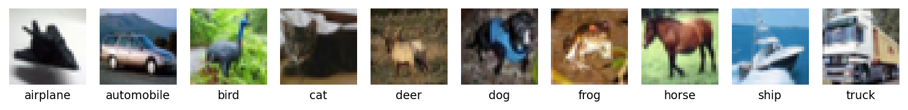
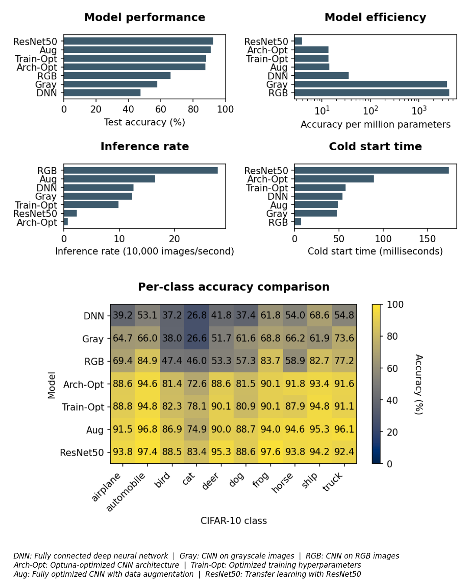

# CIFAR-10 Image Classification Tutorial

[](https://github.com/gperdrizet/CIFAR10/actions/workflows/publish-to-pypi.yml)
[](https://github.com/gperdrizet/CIFAR10/actions/workflows/docs.yml)

[](https://www.python.org/)
[](https://pytorch.org/)
[](https://optuna.org/)
[](https://www.gnu.org/licenses/gpl-3.0)

This repository demonstrates deep learning techniques for image classification using the CIFAR-10 benchmark dataset. Through a series of progressively more sophisticated models, it shows how different neural network architectures and training techniques improve classification performance.

The tools developed for this project are available via PyPI for use in your own projects.
- **PyPi package**: [`image-classification-tools`](https://pypi.org/project/image-classification-tools)
- **Documentation**: [gperdrizet.github.io/CIFAR10](https://gperdrizet.github.io/CIFAR10)
- **Models**: Pre-trained models are available on [HuggingFace](https://huggingface.co/YOUR_USERNAME/CIFAR10)

## About the dataset

CIFAR-10 consists of 60,000 32×32 color images across 10 classes:
- **Training set**: 50,000 images (40,000 for training, 10,000 for validation)
- **Test set**: 10,000 images
- **Classes**: airplane, automobile, bird, cat, deer, dog, frog, horse, ship, truck



## The models

1. [`01-DNN.ipynb`](notebooks/01-DNN.ipynb) - Baseline fully-connected deep neural network on grayscale images
2. [`02-CNN.ipynb`](notebooks/02-CNN.ipynb) - Convolutional neural network to exploit spatial relationships
3. [`03-RGB-CNN.ipynb`](notebooks/03-RGB-CNN.ipynb) - CNN modified to process full RGB color information
4. [`04-architecture_optimization.ipynb`](notebooks/04-architecture_optimization.ipynb) - Optuna optimization of CNN architecture (conv blocks, filters, dropout)
5. [`05-training-optimization.ipynb`](notebooks/05-training-optimization.ipynb) - Optuna optimization of training hyperparameters (optimizer, learning rate, weight decay)
6. [`06-augmented-CNN.ipynb`](notebooks/06-augmented-CNN.ipynb) - Optimized architecture + training with data augmentation
7. [`07-resnet50.ipynb`](notebooks/07-resnet50.ipynb) - Transfer learning with pre-trained ResNet50
8. [`08-results.ipynb`](notebooks/08-results.ipynb) - Model comparison and performance analysis

## Results



## Getting started

### Prerequisites

- [Docker](https://www.docker.com/get-started)
- [Visual Studio Code](https://code.visualstudio.com/)
- [Dev Containers extension](https://marketplace.visualstudio.com/items?itemName=ms-vscode-remote.remote-containers)

### Setup

1. Clone this repository:
```bash
git clone https://github.com/gperdrizet/CIFAR10.git
```

2. Open the repository directory in VS Code

3. When prompted, click **"Reopen in Container"** or use the command palette (Ctrl+Shift+P / Cmd+Shift+P) and select **"Dev Containers: Reopen in Container"**

4. Wait for the container to build and initialize (first time only). The devcontainer will:
   - Set up the Python environment
   - Install all dependencies
   - Download the CIFAR-10 dataset

### Running the notebooks

Once the container environment loads, you can start running the notebooks! 

**Training control**: Each notebook has parameters to control whether to train or load existing models:
- `retrain_model = True` (default): Train a new model
- `retrain_model = False`: Load an existing model (from local disk or Hugging Face Hub)
- `model_source = 'local'` or `'huggingface'`: Choose where to load from

**Note**: Run notebooks in order - some depend on output generated by earlier notebooks.

### Optional: Upload models to Hugging Face Hub

Each notebook includes optional Hugging Face Hub integration to share your trained models:

1. Copy `.env.template` to `.env` and add your repository details
2. Create a Hugging Face account at [huggingface.co](https://huggingface.co/join)
3. Run `huggingface-cli login` in the terminal and enter your access token
4. Set `upload_to_hf = True` in the upload cells

**Note**: Students can download pre-trained models from the default repository (`gperdrizet/CIFAR10`) without any setup by setting `retrain_model=False` and `model_source='huggingface'`.

See [HUGGINGFACE.md](HUGGINGFACE.md) for detailed setup instructions.

## Environment

This project uses a [Dev Container](https://code.visualstudio.com/docs/devcontainers/containers) based on the [deeplearning-GPU](https://github.com/gperdrizet/deeplearning-GPU) template. The container provides a fully configured deep learning environment with PyTorch, TensorFlow, and CUDA - no manual setup required. Just open the project in VS Code and you're ready to train models.

**Why use this setup?**
- **Zero configuration**: CUDA, cuDNN, and ML frameworks are pre-installed
- **Wide GPU support**: Works with any NVIDIA GPU from GTX 1050 to RTX 5090 (Pascal architecture and newer)
- **Cross-platform**: Identical environment on Windows, Linux, or cloud VMs
- **Reproducible**: Everyone gets the exact same dependencies

| Resource | Link |
|----------|------|
| Template Repository | [gperdrizet/deeplearning-GPU](https://github.com/gperdrizet/deeplearning-GPU) |
| Docker Image | [gperdrizet/deeplearning-gpu](https://hub.docker.com/repository/docker/gperdrizet/deeplearning-gpu) |

## Dependencies

Core requirements:
- `python` ≥3.10, <3.13
- `torch` ≥2.0
- `torchvision` ≥0.15
- `numpy` ≥1.24, <2.0
- `matplotlib` ≥3.7
- `optuna` ≥3.0
- `scikit-learn` ≥1.3

## Citation

If you find this project helpful for your learning or work, feel free to reference it:

```bibtex
@software{cifar10_tutorial,
  author = {Perdrizet, George},
  title = {CIFAR-10 Image Classification Tutorial},
  year = {2024},
  url = {https://github.com/gperdrizet/CIFAR10}
}
```

## License

This project is licensed under the GPLv3 License - see the [LICENSE](LICENSE) file for details.